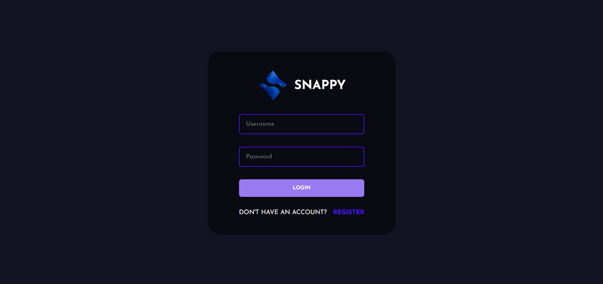
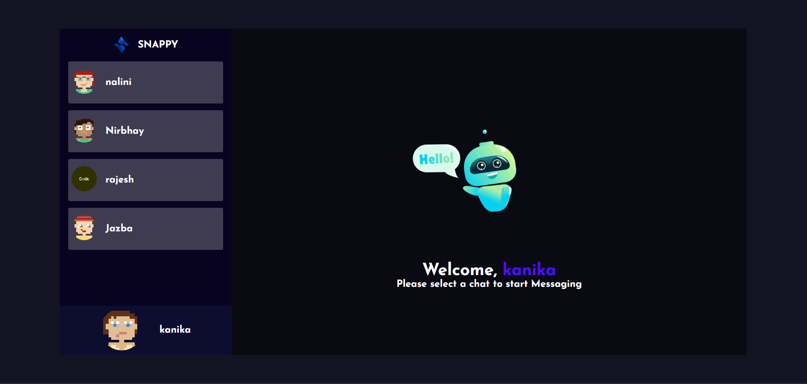
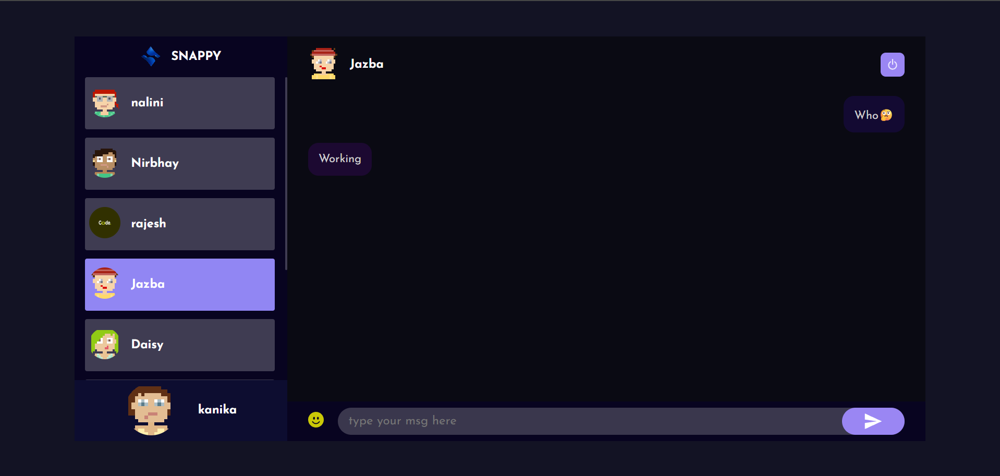

# 💼 Snappy - Chat App

Snappy is a real-time chat application built using the **MERN stack** with **Socket.IO** for instant messaging.

---

## 🚀 Live Demo

👉 [snappy-mga7.vercel.app](https://snappy-mga7.vercel.app)

---

## 🛠️ Tech Stack

- **Backend:** Node.js, Express.js, MongoDB, Socket.IO
- **Frontend:** React
- **Deployment:** Vercel

---

## 🎯 Features

- ✅ Real-time messaging with Socket.IO
- ✅ User authentication and profiles
- ✅ Avatar display functionality
- ✅ Scroll-to-latest chat behavior
- ✅ Clean and minimal UI

---

## 📱 Live Preview







---

## 📬 Contact

- 💼 Linkedin:[linkedin.com/in/kanika-agarwal-b372a6278](https://www.linkedin.com/in/kanika-agarwal-b372a6278)

---

## 📦 Getting Started

To run this project locally:

```bash
git clone https://github.com/Kanikagarwal/snappy.git

cd snappy
cd backend
npm install
npm start

cd frontend
npm install
npm run dev
